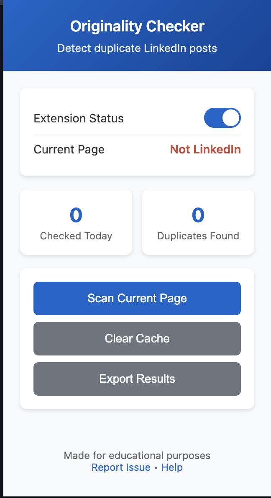

# LinkedIn Originality Checker Browser Extension

A browser extension that helps detect duplicate and copied content on LinkedIn posts. This tool analyzes posts for originality and identifies potential plagiarism or content theft.

## 🚀 Features

- **AI-Powered Analysis**: 
  - Neural network-based content verification
  - Automated writing style analysis
  - Context-aware plagiarism detection
  - Smart content authenticity scoring
- **Automatic Post Detection**: Scans LinkedIn posts as you browse
- **Advanced Originality Scoring**: 
  - AI-enhanced percentage-based scoring
  - Writing style fingerprinting
  - Context understanding
- **Multi-Level Detection**: 
  - AI content analysis
  - Pattern recognition
  - Similar content matching
- **Visual Indicators**: Color-coded buttons showing originality status
- **Comprehensive Analysis**: Shows similar posts with detailed AI insights
- **Export Functionality**: Export analysis data for reporting
- **Privacy Focused**: All analysis happens locally in your browser

## 📦 Installation

### Chrome Extension (Developer Mode)

1. **Download the Extension Files**
   - Save all the provided files in a folder named `linkedin-originality-checker`
   - Create an `icons` folder and add icon files (16x16, 48x48, 128x128 pixels)

2. **Enable Developer Mode**
   - Open Chrome and go to `chrome://extensions/`
   - Toggle "Developer mode" in the top right corner

3. **Load the Extension**
   - Click "Load unpacked"
   - Select the `linkedin-originality-checker` folder
   - The extension should now appear in your extensions list

4. **Pin the Extension**
   - Click the puzzle piece icon in your browser toolbar
   - Pin the "LinkedIn Originality Checker" extension

### Firefox Extension

1. **Prepare for Firefox**
   - Change `manifest_version` to `2` in `manifest.json`
   - Update permissions format for Firefox compatibility

# LinkedIn Originality Checker

- Try scrolling to load more posts

---

## ✨ Features

- **One-Click Originality Check**: Adds a "Check Originality" button to every LinkedIn post.
- **AI-Enhanced Analysis**: Smart algorithms analyze text, structure, and style for originality.
- **Similarity Detection**: Finds and displays similar posts from your browsing history and the web.
- **At-a-Glance Results**: Color-coded scores and detailed popups show originality and match details.
- **Batch Scanning**: Scan all posts on a page with one click from the popup.
- **Daily Stats**: Track how many posts you've checked and duplicates found.
- **Export & Clear Data**: Export your analysis results or clear your cache easily.
- **Privacy First**: All analysis happens locally in your browser—no data is sent to servers.

---

## 🖼️ How It Looks

<p align="center">
  
</p>

*Above: Example of the extension showing similar posts and originality scores in a LinkedIn feed.*

---

## � Getting Started

### 1. Download & Install

1. **Clone or Download** this repository.
2. **Open Chrome** and go to `chrome://extensions/`.
3. **Enable Developer Mode** (top right).
4. **Click "Load unpacked"** and select the `linkedin-post-originality-checker` folder.
5. **Pin the Extension** for easy access.

### 2. Using the Extension

1. **Go to LinkedIn** and browse your feed.
2. **Click "Check Originality"** on any post to analyze it.
3. **View Results**: See the originality score, similar posts, and details in a popup.
4. **Use the Popup**: Click the extension icon for batch scan, stats, export, and more.

---

## 🗂️ File Structure

```
linkedin-originality-checker/
├── manifest.json         # Extension manifest (permissions, scripts)
├── background.js         # Background service worker (analysis, storage)
├── content.js            # Content script (injects UI, extracts post data)
├── popup.html            # Extension popup UI
├── popup.js              # Popup logic (batch scan, stats, export)
├── style.css             # Styles for injected UI
├── popup.css             # Styles for popup
├── icons/                # Extension icons (16, 48, 128 px)
├── README.md             # This file
└── example-screenshot.png # Example screenshot (add your own)
```

---

## 🧠 How It Works

1. **Content Script** (`content.js`):
   - Detects LinkedIn posts in your feed.
   - Injects a "Check Originality" button into each post.
   - Extracts post text, author, and URL for analysis.
   - Displays results in a stylish popup.

2. **Background Script** (`background.js`):
   - Receives analysis requests from the content script.
   - Analyzes post text for originality, style, and similarity.
   - Searches your local cache and the web for similar content.
   - Handles storage, caching, and error handling.

3. **Popup** (`popup.html`, `popup.js`):
   - Lets you scan all posts on the current page.
   - Shows daily stats (checked, duplicates found).
   - Allows you to clear cache or export your data.

---

## 🛡️ Privacy & Security

- **Local-Only Processing**: All analysis and storage happens in your browser.
- **No Tracking**: The extension does not track or send your data anywhere.
- **Open Source**: Review the code and verify privacy for yourself.

---

## ⚙️ Technical Highlights

- **Manifest V3**: Modern Chrome extension architecture.
- **MutationObserver**: Detects new posts as you scroll.
- **Chrome Storage API**: Efficient, secure local data storage.
- **Robust Error Handling**: Graceful handling of all errors and edge cases.
- **Responsive UI**: Looks great in both light and dark mode.

---

## 📝 Example Usage

1. **Check a Post**: Click "Check Originality" on any LinkedIn post. See a popup with originality score and similar posts.
2. **Batch Scan**: Open the extension popup and click "Scan Current Page" to analyze all visible posts.
3. **Export Results**: Use the popup to export your analysis data as JSON.

---

## 🧩 Compatibility

- **Chrome**: Fully supported (Manifest V3)
- **Edge**: Supported (Chromium-based)
- **Firefox**: Supported with minor manifest changes

---

## �️ Troubleshooting

- **Not working?**
  - Make sure you're on linkedin.com
  - Ensure the extension is enabled
  - Reload LinkedIn after installing

---

## 📢 Disclaimer

This extension is for educational and research purposes only. Always respect platform terms of service and copyright laws when using automated tools.
- Use "Scan Current Page" manually
- Check if LinkedIn updated their page structure

**Popup Not Opening**
- Right-click extension icon and select options
- Disable and re-enable the extension
- Check for browser updates

### Performance Tips

- **Clear Cache Regularly**: Use the "Clear Cache" button in popup
- **Limit Batch Scanning**: Don't scan too many posts at once
- **Monitor Memory**: Close unused tabs to free memory
- **Update Regularly**: Keep the extension updated

## 📈 Future Enhancements

Current implementation includes real-time search and advanced similarity detection. Future improvements could include:

- **Enhanced AI Integration**:
  - Machine learning for pattern recognition
  - Neural network-based text analysis
  - Automated threshold optimization
  - Context-aware similarity detection

- **Extended Capabilities**:
  - Image content analysis
  - Multi-language support
  - Audio/video content checking
  - Real-time trend analysis

- **Platform Enhancements**:
  - Custom similarity thresholds
  - User-defined quality metrics
  - Advanced reporting features
  - Team collaboration tools
  - API integration options

- **Performance Optimizations**:
  - Distributed processing
  - Enhanced caching strategies
  - Reduced memory footprint
  - Faster search algorithms

- **Analytics Features**:
  - Content trend analysis
  - Plagiarism pattern detection
  - User behavior insights
  - Performance metrics tracking

## 🔗 Development

### Customization

To modify the extension:

1. **Edit Content Detection**: Modify selectors in `content.js`
2. **Change Scoring Algorithm**: Update logic in `background.js`
3. **Customize UI**: Modify styles in `styles.css`
4. **Add Features**: Extend popup functionality in `popup.html`

### Testing

- Test on different LinkedIn page types (feed, posts, profiles)
- Verify compatibility with LinkedIn updates
- Check performance with large numbers of posts
- Test privacy and security measures

## 📄 License

This extension is created for educational purposes. Please respect:
- LinkedIn's Terms of Service
- Copyright and fair use laws
- Privacy and data protection regulations
- Rate limiting and API usage policies

## 🤝 Contributing

This is a demonstration project. For a production version:
- Implement proper error handling
- Add comprehensive testing
- Integrate with real APIs
- Enhance security measures
- Add user feedback systems

---

**Disclaimer**: This extension is for educational and research purposes only. Always respect platform terms of service and copyright laws when using automated tools.